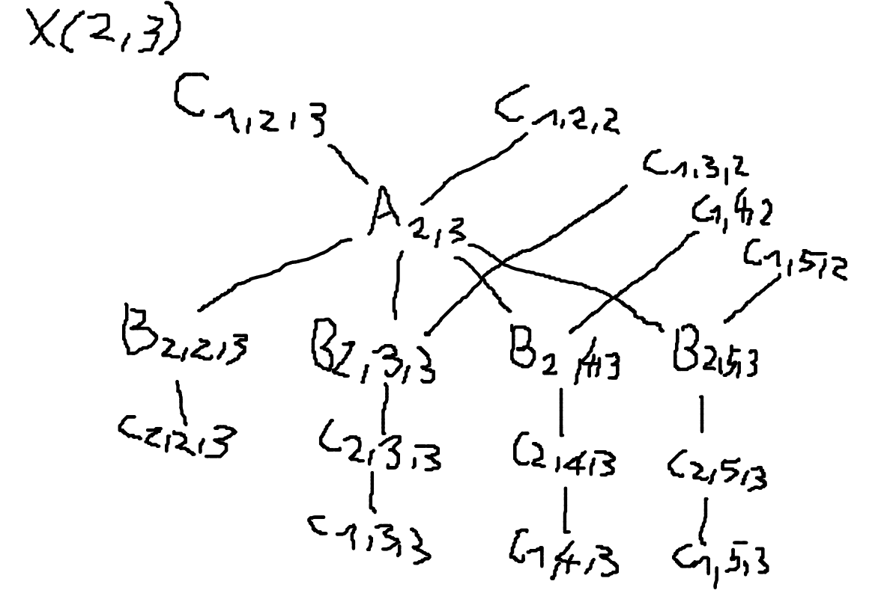

# Współbieżna eliminacja Gaussa

## Wstęp teoretyczny

Eliminacja Gaussa służy do obliczania układów równań liniowych postaci $M \times x = y$.
Układ równań można przedstawić jako:


Dla wygody obliczeń, algorytm może potraktować macierz M i wektor y jako całość:


Algorytm korzysta z 3 elementarnych, niepodzielnych operacji:
```py
def A(i, k):
    """ znalezienie mnożnika dla wiersza i, do odejmowania go od k-tego wiersza """
    m[k][i] = M[k][i] / M[i][i]
    
def B(i, j, k):
    """ pomnożenie j-tego elementu wiersza i przez mnożnik - do odejmowania od k-tego wiersza """
    n[i][j][k] = M[i][j] * m[k][i]

def C(i, j, k):
    """ odjęcie j-tego elementu wiersza i od wiersza k """
    M[k][j] = M[k][j] - n[i][j][k]
```

Sam algorytm ma postać:

```py
for i in range(N-1):
    for k in range(i+1, N):
        A(i, k)
        for j in range(i, N+1):
            B(i, j, k)
            C(i, j, k)
```

Po każdej operacji A(i, k) następuje ciąg operacji:
B(i, i, k), C(i, i, k), B(i, i+1, k), C(i, i+1, k), ..., B(i, N, k), C(i, N, k)

Gdyby pominąć operacje B i C, algorytm miałby postać:
A(0, 1), A(0, 2), ..., A(0, N-1), ..., A(1, 2), A(1, 3),...A(1, N-1),..., ...,A(N-3, N-2), A(N-3, N-1), A(N-2, N-1)

Wszystkie wyznaczone przez algorytm operacje składają się na alfabet w sensie teorii śladów.
W dodatku, gdyby przedstawić je w kolejności takiej jak wykonywane są przez pseudokod powyżej, powstały ciąg symboli
alfabetu byłby algorytmem w sensie teorii śladów.

Taki ciąg miałby postać:
A(0,1), B(0, 0, 1), C(0, 0, 1), ...,B(0, N, 1), C(0, N, 1),...,A(0, N-1), B(0, 0, N-1), C(0, 0, N-1), ... B(0, N, N-1),
C(0, N, N-1),..., A(N-2, N-1), B(N-2, N-2, N-1), C(N-2, N-2, N-1), B(N-2, N-1, N-1), C(N-2, N-1, N-1), B(N-2, N, N-1),
C(N-2, N, N-1).

Dla dowolnej pary (i, k) takiej, że A(i, k) należy do alfabetu, definiuje się podzbiór relacji zależności X(i, k):

X(i, k) = sym({(A(i,k), C(i-1,i,k)), (A(i,k), C(i-1,i,i)), (B(i, i, k), A(i, k)), (B(i, i+1, k), A(i, k)), ...,
(B(i,N,k), A(i,k)), (B(i,i+1,k), C(i-1,i+1,i)), (B(i,i+2,k), C(i-1,i+2,i)), ..., (B(i,N,k), C(i-1,N,i)),
(C(i,i,k), (B(i,i,k)), (C(i,i+1,k), B(i,i+1,k)), ..., (C(i,N,k), B(i,N,k)), (C(i,i+1,k), C(i-1,i+1,k)),
(C(i,i+2,k), C(i-1,i+2,k)), ..., (C(i,N,k), C(i-1,N,k))})

Relacja zależności D to suma wszystkich istniejących X(i, k).

Sposób budowania X(2, 3) i X(2, 4) dla N=5 przedstawiono na wykresach poniżej:




Przykładowy graf zależności Diekerta, dla N=4, wygenerowany za pomocą programu graphviz:


Postać normalna Foaty dla dowolnego N ma postać:

FNF = (A(0, 1),...,A(0,N-1))
(B(0,0,1),...,B(0,N,1),...,B(0,0,N-1),...,B(0,N,N-1))
(C(0,0,1),...,C(0,N,1),...,C(0,0,N-1),...,C(0,N,N-1))
((A(1, 2),...,A(1,N-1)))
(B(1,1,2),...,B(1,N,2),...,B(1,1,N-1),...,B(1,N,N-1))
(C(1,1,2),...,C(1,N,2),...,C(1,1,N-1),...,C(1,N,N-1))
...
(A(N-2,N-1))
(B(N-2,N-2,N-1), B(N-2,N-1,N-1), B(N-2,N,N-1))
(C(N-2,N-2,N-1), C(N-2,N-1,N-1), C(N-2,N,N-1))

## Implementacja - algorytm korzystający z postaci Foaty
